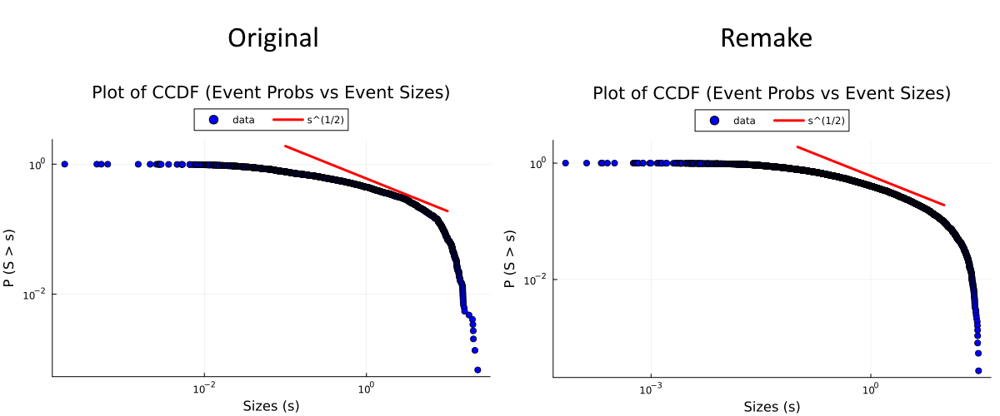
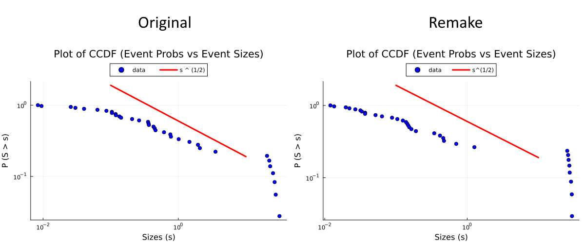

# Slip Simulation: Remake

C++ source code for the remade "Slip Simulation" program, in service of the Dahmen Research Group's Avalanche Initiative.
This code simulates our slip mean-field model exactly.

## Partial Weakening

This branch simulates the partial weakening model where only a fraction of the system size experiences the weakening effect.

## Improvements

_Note: the weakening parameter argument is now -e for epsilon, to reflect the fact that eps < 0 is strengthening_

This new edition revised practically almost all parts of the original, save for the core concept.
Here is the list of significant improvements made.

1) The loop algorithm has been remade to be dramatically more effiecient. This means that the performance disparity increases with
the number of timesteps and system size. Presently, for MAX_TIME=100000 and AREA=1000, this remade version is about **15 times faster** than the original.

2) The system initialization algorithm was remade so that the system starts in steady state immediately instead of having to wait, which
consumes initial timesteps.

3) The random number engine has been updated from the ancient modified Lagged Fibonacci to the Mersenne Twister.
This *slightly* improves the statistics from the original (see below), as well as efficiency.

Comparing default CCDF plot with timestep=100000


Comparing default CCDF plot with timestep=1000


4) Added a Makefile (described below) which will automatically take care of building the program on Campus Cluster (and UNIX local machine)

5) The code has been updated to conform with modern C++20 conventions, which improve performance and organization. The code itself is also
a little better documented now.

## Building on Campus Cluster and UNIX

A Makefile is included in this code which will automatically handle the building process, provided you have the gcc toolchain installed.
To build the program, simply type
```
make <target_name>
```
There are three targets to choose from `slip_sim_sandbox, slip_sim_cluster and slip_sim_debug`. You probably won't need the debug version.
If you are on Campus Cluster, make sure the gcc module is loaded.

If you wish to change the C++ compiler for any reason (looking at you, Ethan!), change the right side of `$(CXX) = g++`
in the first line of the Makefile to whatever compiler or specific version you like. Additionally, example .sbatch and autosubmit shell
file are also included for running the program on Campus Cluster.

## Creators and Maintainers

This code is a remade version of the original slip simulation by Alan Long, made Jun 20 2019, and modified by Ethan Mullen in 2025.

The creator, and current maintainer of this version is Punnatorn Thienkingkeaw (Porpun), remade on 2/10/2025.
Any bugs or problems or questions about the code should be directed at the person named above, or the current project owner, Ethan Mullen.

## Editing with Visual Studio 2022

Project files for Visual Studio 2022 are included for those who wish to edit on Windows. The program can also run on Windows and be debugged
using Visual Studio standard debugging tools, since no part of the code is system specific. Those on UNIX can safely ignore these files.
